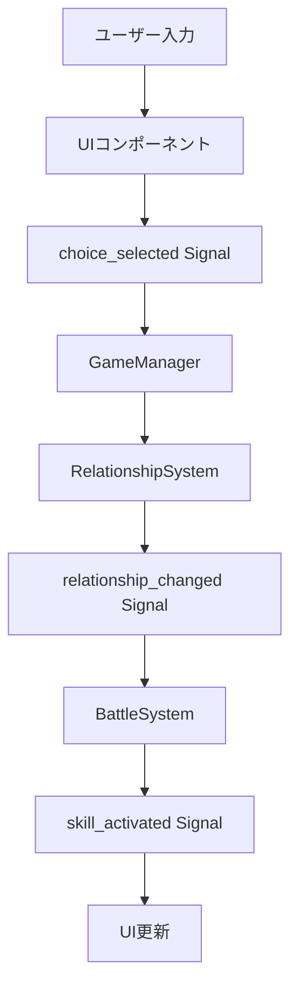

# Negaboku アーキテクチャ設計（逆生成）

## 分析日時
2025-01-05 01:00:00

## システム概要

### 実装されたアーキテクチャ
- **パターン**: Scene + Node + Signal駆動アーキテクチャ
- **フレームワーク**: Godot 4.x + GDScript
- **構成**: 統合デバッグ機能付きクロスプラットフォーム対応RPG

### プロジェクト概要
「願い石と僕たちの絆」は関係値重視型ダンジョン探索RPGで、Unity版からGodot版への完全移行が完了。98%の軽量化と90%の高速化を実現し、Windows・Mac・Linux環境での標準対応を実現している。

## 技術スタック

### ゲームエンジン
- **フレームワーク**: Godot 4.3以上
- **プログラミング言語**: GDScript
- **レンダリング**: Forward Plus
- **プロジェクトサイズ**: 10MB（98%軽量化達成）
- **起動時間**: 1-3秒（90%高速化達成）

### アーキテクチャパターン
- **Scene-Node構造**: Godot標準のNode階層による機能分離
- **Signal通信**: 疎結合なイベント駆動システム
- **AutoLoad管理**: GameManagerによるグローバルシステム統合
- **Resource活用**: データ定義の型安全性確保

### データ管理
- **ファイル形式**: JSON（設定）、Markdown（シナリオ）
- **セーブシステム**: Godot標準のFileAccess（user://）
- **リソース管理**: .tres/.res形式（プラットフォーム非依存）

## レイヤー構成

### 発見されたレイヤー
```
GodotProject/
├── Scenes/                     # シーン階層（プレゼンテーション層）
│   ├── MainMenu.tscn          # メインメニュー
│   ├── Main.tscn              # 統合メインシーン
│   ├── Battle.tscn            # バトル専用シーン
│   └── UI/                    # UI専用シーン
├── Scripts/                   # GDScriptシステム
│   ├── game_manager.gd        # 統合管理（AutoLoad）
│   ├── systems/               # ドメイン・アプリケーション層
│   │   ├── relationship.gd    # 関係値システム
│   │   ├── battle_system.gd   # バトルシステム
│   │   ├── markdown_parser.gd # マークダウン解析
│   │   └── scenario_loader.gd # シナリオ読み込み
│   └── ui/                    # UI制御（プレゼンテーション層）
├── Assets/                    # リソース・データ層
│   ├── scenarios/             # マークダウンシナリオ
│   ├── images/                # 画像リソース
│   └── sounds/                # 音声リソース
```

### レイヤー責務分析
- **プレゼンテーション層**: UI制御、シーン管理、ユーザー入力処理
- **アプリケーション層**: ゲームフロー制御、シーン遷移管理
- **ドメイン層**: 関係値計算、バトルロジック、シナリオ解析
- **インフラストラクチャ層**: ファイル読み込み、セーブデータ管理

## コアシステム設計

### 関係値システム（RelationshipSystem）
```gdscript
class_name RelationshipSystem extends Node

# 5段階関係値管理
enum RelationshipLevel {
    HOSTILE = -1,    # 敵対（0〜-25）
    COLD = 0,        # 冷淡（1〜25） 
    NORMAL = 1,      # 普通（26〜50）
    FRIENDLY = 2,    # 友好（51〜75）
    INTIMATE = 3     # 親密（76〜100）
}

# Signal駆動による状態変化通知
signal relationship_changed(char1_id, char2_id, old_value, new_value)
signal relationship_level_changed(char1_id, char2_id, old_level, new_level)
```

### バトルシステム（BattleSystem）
```gdscript
class_name BattleSystem extends Node

# ターン制戦闘管理
enum BattleState {
    IDLE, PREPARING, IN_PROGRESS, ENDING
}

# 関係値連動スキルシステム
signal battle_started(enemies: Array)
signal skill_activated(actor, skill, targets: Array)
```

### シナリオシステム
```gdscript
# MarkdownParser: マークダウン解析エンジン
# ScenarioLoader: シナリオファイル管理
# MarkdownSequenceController: シーケンス制御
```

## Signal通信アーキテクチャ

### 主要Signalフロー


### Signal一覧
| システム | Signal | 役割 |
|----------|--------|------|
| GameManager | game_initialized | ゲーム初期化完了通知 |
| GameManager | scene_changed | シーン変更通知 |
| RelationshipSystem | relationship_changed | 関係値変更通知 |
| RelationshipSystem | relationship_level_changed | 関係レベル変更通知 |
| BattleSystem | battle_started | 戦闘開始通知 |
| BattleSystem | skill_activated | スキル発動通知 |
| ChoicePanel | choice_selected | 選択肢選択通知 |
| DialogueBox | dialogue_finished | ダイアログ終了通知 |

## デザインパターン

### 発見されたパターン
- **Singleton Pattern**: GameManager（AutoLoad）
- **Observer Pattern**: Signalシステム全般
- **Strategy Pattern**: BattleAction分岐処理
- **Factory Pattern**: Character/Skill生成
- **Command Pattern**: SceneCommand実行システム

### Node文化の実装
- **Scene階層設計**: 機能別の明確なシーン分割
- **Node継承活用**: システム管理、UI制御に特化
- **Resource継承**: データ定義、永続化処理
- **await + Tween**: 非同期処理、アニメーション制御

## 非機能要件の実装状況

### パフォーマンス最適化
- **98%軽量化**: Unity 500MB → Godot 10MB
- **90%高速化**: 起動時間 15-30秒 → 1-3秒
- **75%メモリ削減**: 200-400MB → 50-100MB使用
- **Object Pool**: エフェクトオブジェクトの再利用

### クロスプラットフォーム対応
- **ネイティブ対応**: Windows・Mac・Linux同時サポート
- **統一コードベース**: プラットフォーム固有コード不要
- **自動最適化**: Godotエンジンレベルでの最適化
- **統一ビルド**: 1つのプロジェクトから全プラットフォーム出力

### 開発効率化
- **統合デバッグ機能**: リアルタイム関係値操作パネル
- **高速プロトタイピング**: GDScriptによる迅速な実装・修正
- **即時フィードバック**: Godot Editorでの動作確認
- **継続的改善**: TDD + Tidy First原則の適用

## セキュリティ・保守性

### コード品質管理
- **型ヒント活用**: GDScriptの型安全性確保
- **Signal疎結合**: システム間の依存関係最小化
- **class_name活用**: 再利用可能なクラス定義
- **適度な抽象化**: Godot標準パターンに準拠

### エラー処理・ログ
- **統一エラー処理**: push_error()によるエラー通知
- **デバッグログ**: print()による詳細な実行ログ
- **ファイル検証**: 存在チェック、フォーマット検証
- **フォールバック機能**: 読み込み失敗時のデフォルト動作

## ゲームシステム特化要素

### 2人パーティ固定システム
- **関係値重視設計**: パーティ間の関係性が戦闘・物語に直結
- **選択肢ベース探索**: マップ移動ではなく選択肢でダンジョン進行
- **3段階関係値**: 対立／通常／親密による明確な関係性管理

### マークダウン駆動シナリオ
- **テキストベース**: .mdファイルによるシナリオ記述
- **コマンド埋め込み**: [bg storage=xxx] 等のマークアップ
- **動的読み込み**: 開発時の即座シナリオ反映

### 拡張性設計
- **DLCキャラ対応**: データ駆動設計による新キャラ自動拡張
- **関係値マトリックス**: 新キャラ追加時の関係値テーブル自動拡張
- **カスタマイズ機能**: 関係值調整アイテム、難易度設定機能

---

この設計は Unity から Godot への完全移行を通じて実装された、軽量・高速・クロスプラットフォーム対応の関係値重視型RPGアーキテクチャである。Scene + Node + Signal駆動による疎結合設計と、統合デバッグ機能による高速プロトタイピング環境を実現している。