# Negaboku データフロー設計（逆生成）

## 分析日時
2025-01-05 01:00:00

## ゲームフロー概要

### メインゲームループ
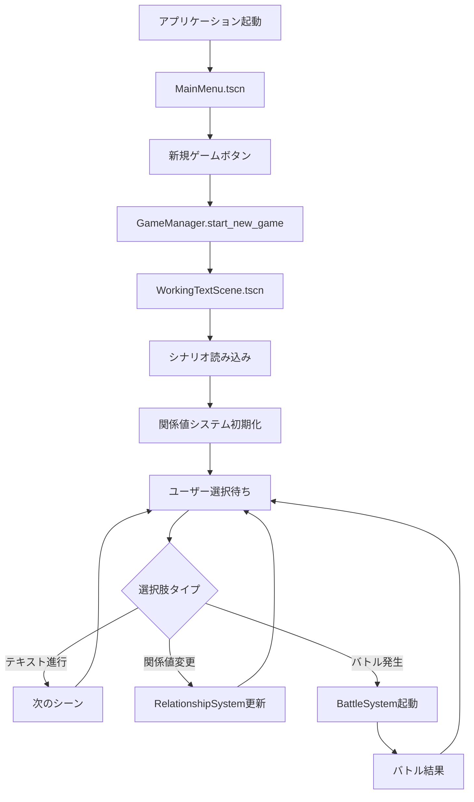

## 関係値システムフロー

### 関係値変更プロセス
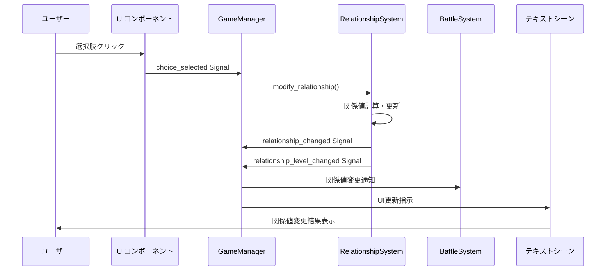

### 関係値計算フロー
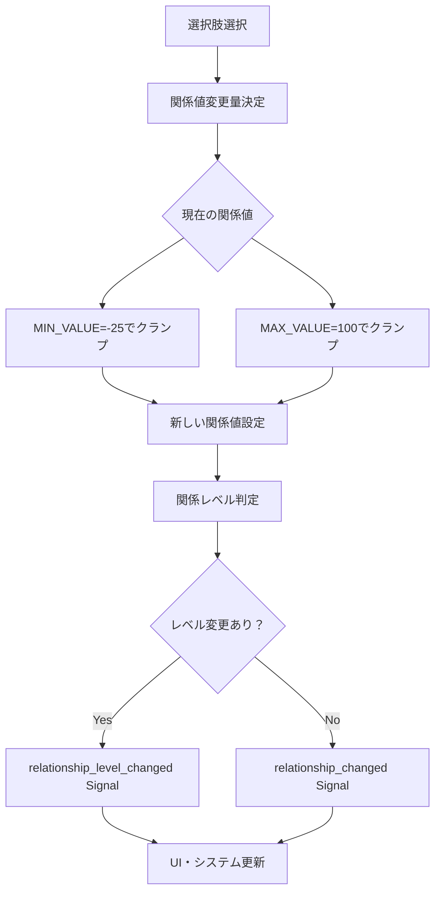

## バトルシステムフロー

### ターン制戦闘プロセス
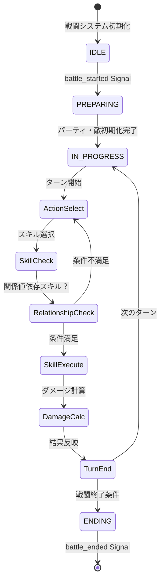

### 関係値連動スキルシステム
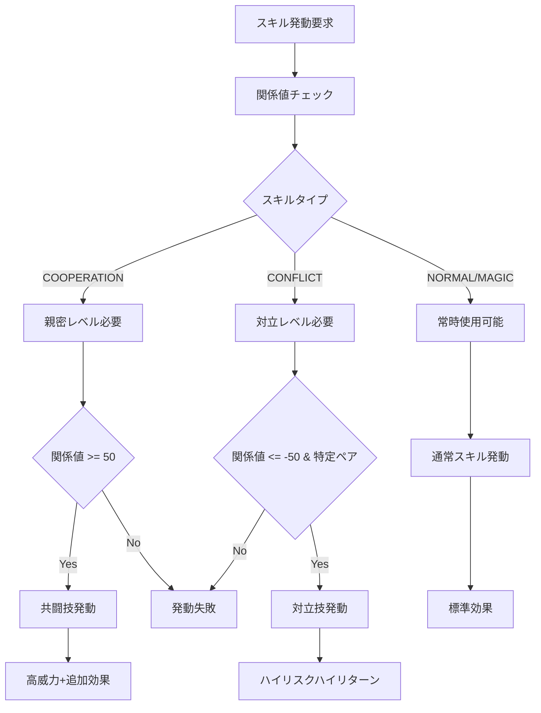

## シナリオシステムフロー

### マークダウンファイル処理フロー
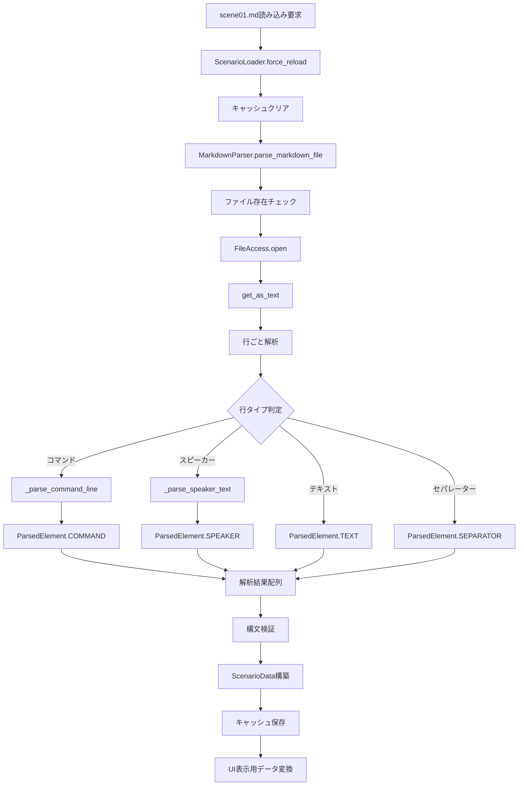

### シーン表示フロー
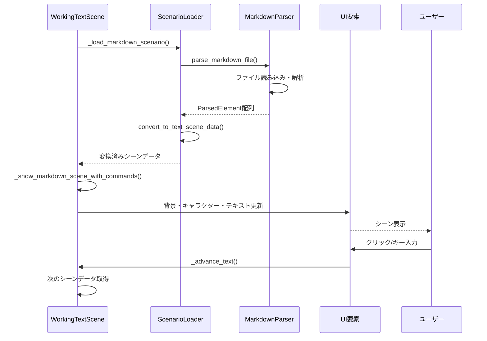

## UI・入力処理フロー

### ユーザー入力処理
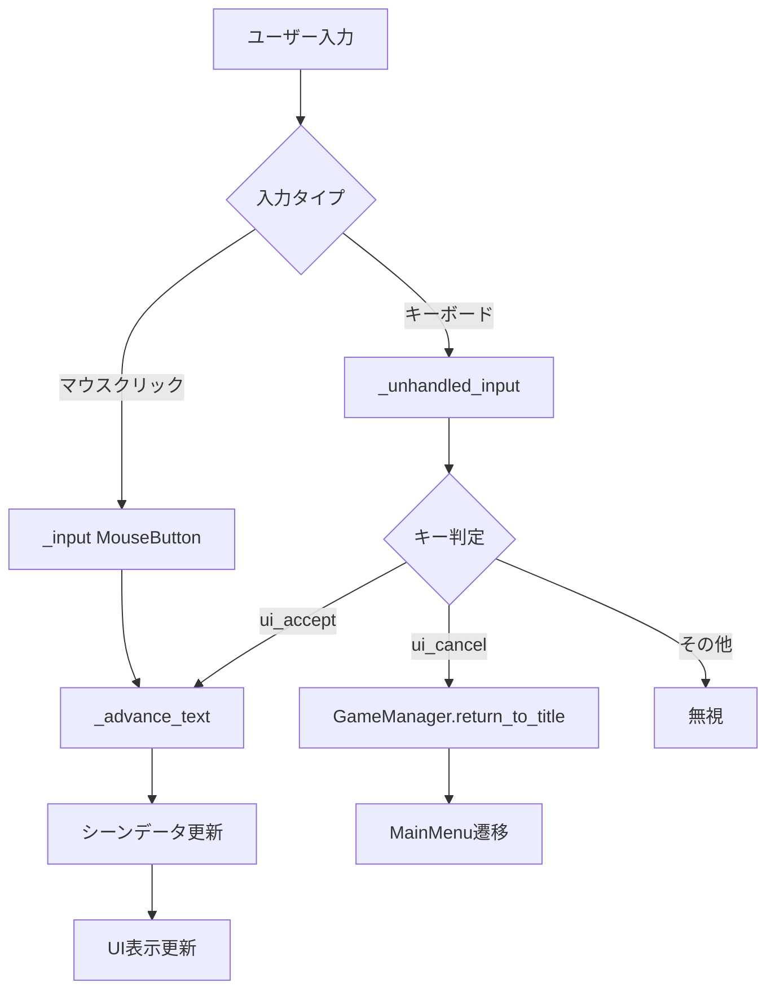

### Signal連鎖フロー
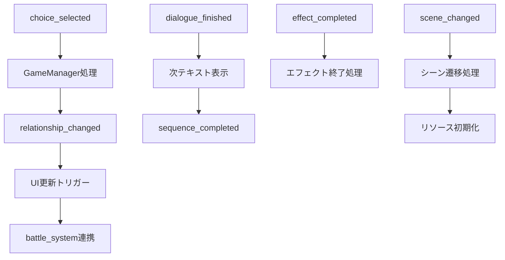

## データ永続化フロー

### セーブ・ロードシステム
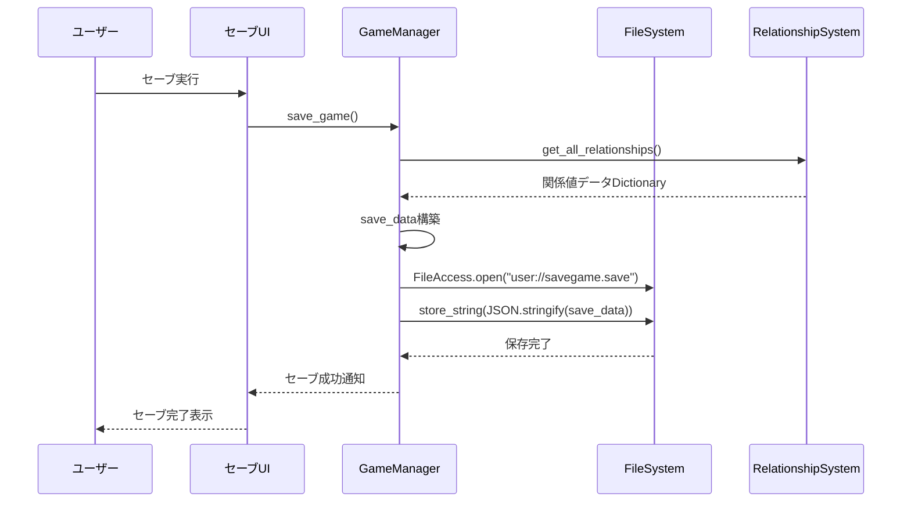

## エラー処理・フォールバックフロー

### ファイル読み込みエラー処理
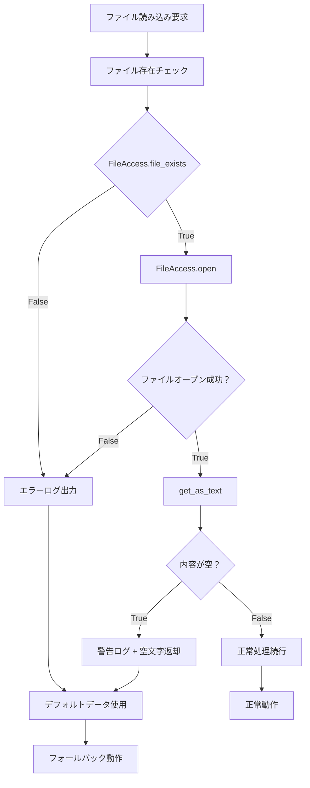

## パフォーマンス最適化フロー

### リソース管理最適化
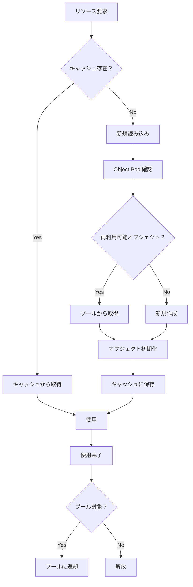

## 統合デバッグフロー

### リアルタイムデバッグ機能
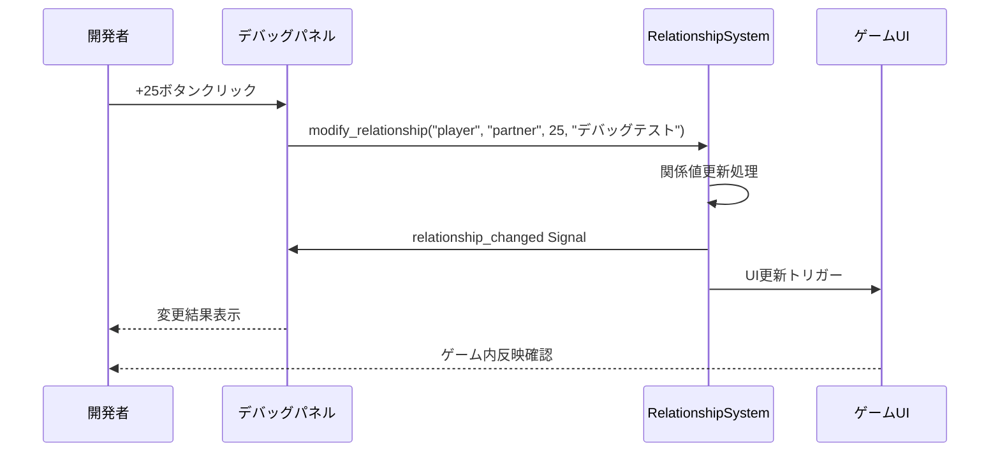

---

このデータフローは Godot の Scene + Node + Signal 駆動アーキテクチャを活用し、関係值重視型RPGの特性を反映した疎結合なイベント駆動システムを実現している。リアルタイムデバッグ機能により開発効率を大幅に向上させながら、エラー処理・フォールバック機能で安定性を確保している。